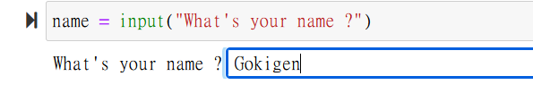

# Welcome!

## 

#### Introduction

#### Part 1: Hitchin' Up Your Python Wagon

Chapter 1: Drawing Polygons with Turtles\
Chapter 2: Making Tedious Arithmetic Fun with Lists and Loops\
Chapter 3: Guessing and Checking with Conditionals

#### Part 2: Riding into Math Territory

Chapter 4: Transforming and Storing Numbers with Algebra\
Chapter 5: Transforming Shapes with Geometry\
Chapter 6: Creating Oscillations with Trigonometry\
Chapter 7: Complex Numbers\
Chapter 8: Using Matrices for Computer Graphics and Systems of Equations

#### Part 3: Blazing Your Own Trail

Chapter 9: Building Objects with Classes\
Chapter 10: Creating Fractals Using Recursion\
Chapter 11: Cellular Automata\
Chapter 12: Solving Problems Using Genetic Algorithms
