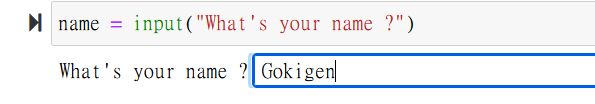

# 3. Guessing and Checking with Conditionals

## 學習重點

* 數學\
  餘數、因數、平均、開根號
* 程式\
  條件式的寫法、隨機數的生成、I/O的使用

## 程式

### 條件式的寫法

#### 1. 比較算子

.png>)

#### Homework

* 請解釋 "=" 與 "==" 的不同

#### 2. 條件式的結構

if (判斷條件A): // 如果 A 是真的\
&#x20;   做 B 行為 // 則執行 B\
elif (判斷條件C): // 如果 C 是真的\
&#x20;   做 D 行為 // 則執行 D\
else: // A 和 C 都不成立, 則 ...\
&#x20;   做 E 行為 // 則執行 E

.png>)

#### Homework

* 請問 elif 是必要的嗎？
* 如何使用條件式，找出 20 的因數？\
  提示：如果 20 % i 為 0, 則 i 是 20 的因數
* 進階：使用 Python 的函數庫 gcf(s,t) 找出 s 和 t 的最大公因數\
  並寫一個程式能達到 gcf 一樣的功能

### 隨機數的生成

.png>)

### I/O的使用

學會使用 input 與使用者互動

.png>)

#### Homework

* 寫一個猜數字遊戲。用隨機數決定一個數字 number，然後給使用者輸入他猜的數字 guess。如果使用者猜對（guess == number），則結束。若沒猜中，則程式要提示使用者 guess 跟 number 的關係（大於或小於）。
* 寫一個函數，能夠算出：使用者輸入的數字 x 的平方根。提示：會用到平均數、條件式、迴圈
